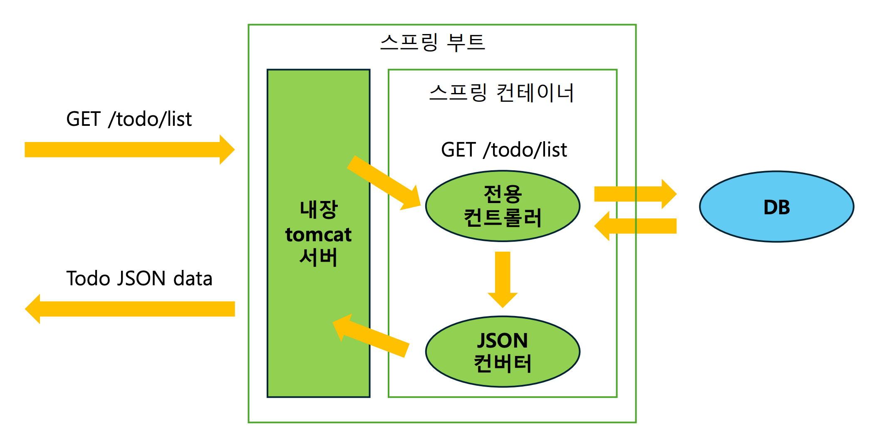
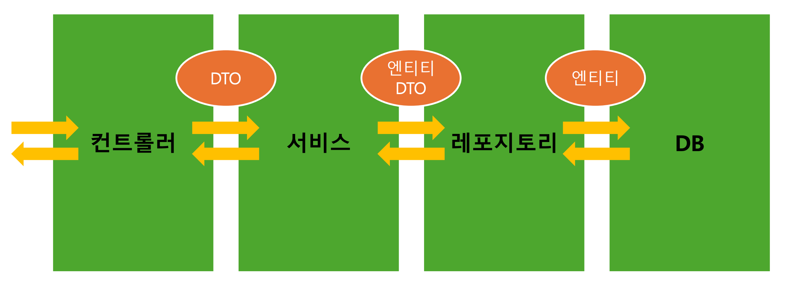
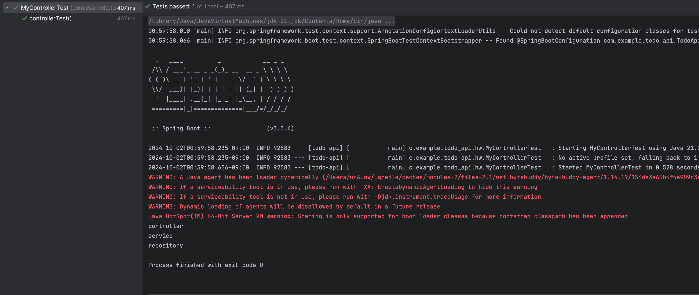

# 스프링과 빈

-----

## 스프링
    • JAVA 진영의 대표적인 백엔드 프레임워크    
    • 객체지향 원칙을 지키면서 개발할 수 있도록 도와준다.

## 스프링부트
    • 스프링 프레임워크를 사용하여 개발할 때, 편의를 더해주는 도구    
    • 스프링으로 개발할 때는 스프링 부트를 함께 사용한다.

## 스프링 어플리케이션 구조 

---
## 스프링 빈
• 어플리케이션에서 사용하는 공용 <u>**객체**</u>  
• **스프링 컨테이너**라고 하는 공용 창고에 **빈(객체)** 을 저장해두고, 필요한 빈을 컨테이너에서 받아 사용한다.  
• 필요한 빈은 스프링 프레임워크가 자동으로 가져다 준다. 이때 빈을 요구하는 객체도 스프링 빈이다.    
• **스프링 빈은 기본적으로 1개의 객체이다. 따라서 컨테이너에서 빈을 가져올 때마다 같은 객체가 반환된다.**
## 스프링 컨테이너
• 스프링 빈이 저장되는 공간    
• **어플리케이션 컨텍스트(Application Context)** 라고도 한다.

---

## 스프링에 빈을 저장
### 설정 파일 작성(수동 등록)
• 설정 파일은 자바 클래스로 작성한다.  
• 이때 클래스에 **@Configuration**으로 설정 파일임을 명시     
• 메인에서 빈 생성 -> 테스트에서 클래스(TestConfig)에 **@Configuration**, 메서드에 **@Bean** 어노테이션 사용     
• 테스트 클래스를 따로 생성 후 **ApplicationContext** 으로 컨테이너 생성    

    ApplicationContext context = new AnnotationConfigApplicationContext(테스트에 사용할 Config클래스.class) 
    //스프링 컨테이너를 생성할 때, 컨테이너에 등록할 빈 정보가 담긴 Config 클래스를 넘길 수 있다.
### 컴포넌트 스캔(자동 등록)  
• 빈을 생성할 클래스에 **@Component** 어노테이션 사용   
• 어플리케이션을 시작할 때 **@Component**가 붙은 클래스를 찾아서 자동으로 빈 등록  
• 컴포넌트 스캔은 **@Component** 어노테이션 사용  
• 기존 TestConfig 내용을 모두 지우고, **@ComponentScan** 추가  
->스캔해서 발견한 컴포넌트를 빈으로 등록한다.  

### 정리
• 설정 파일 작성  
  클래스: **@Configuration**, 빈: **@Bean**    
• 컴포넌트 스캔   
  클래스: **@Component**, 설정파일(Config) 클래스: **@ComponentScan** 이때, 설정 파일 안 내용은 지운다.(@Bean 사용할 필요 x)      
• 내가 등록할 빈을 생성하는 클래스에 @Component를 붙이면 끝
---
## 의존성 주입 (Dependency Injection, DI)
**내가 의존하는 객체를 직접 생성하지 않고 밖에서 주입 받는 것**  
스프링에서는 컨테이너에 저장된 빈(객체)과 빈(객체)사이의 의존성을 프레임워크가 주입하는 것을 말한다.

### 의존성을 주입 받는 이유
• 객체 지향 원칙 중 하나인 **OCP(Open Close Principle) 원칙**을 준수한다.    
(필요한 객체를 내가 하드코딩하지 않기 때문에 유지보수하기 좋아진다)  
• 매번 필요한 객체를 생성하는 대신, 생성해둔 객체를 사용하므로 **메모리를 효율적으로 사용**할 수 있다.   

### 의존성 주입 방법
• 어떤 객체에 다른 객체를 주입하려면, 주입할 **통로**가 필요하다.    
• 우리는 통로를 만들고, 이 통로를 통해 주입해 달라고 표시해두면 프레임워크가 알아서 객체를 주입해준다. 
• 통로는 크게 생성자, 필드, 메서드가 존재한다.    
• 표시를 남길 때는 **@Autowired** 어노테이션으로 표시를 남긴다. 

### 생성자 주입
• 의존성이 바뀔 일이 없는 경우 안전하게 final로 선언한다.    
• 이때 final 필드는 생성자를 통해 초기화되어야 한다.   
• 생성자에 **@Autowired** 을 사용하면, 생성자를 통해 빈을 주입한다.  
• 만약 생성자가 하나만 있다면, **@Autowired**를 생략할 수 있다.   
• **@RequiredArgsConstructor**를 사용하면 모든 final 필드에 대한 생성자를 자동으로 만들어주어
생성자 코드까지 생략할 수 있다.  
#### 생성자 주입 정리
1. 필요한 의존성을 final 키워드를 사용해 추가한다.
2. **@RequiredArgsConstructor**를 사용해 생성자를 추가한다.

### 필드 주입
• 필드에 바로 **@Autowired** 어노테이션을 사용한다. (final은 사용 불가) 
• 이 방식은 주로 테스트 코드에서 사용한다.   
• 테스트에서 필드 주입을 하려면, 테스트를 실행할 때 이미 스프링 컨테이너가 존재해야 한다.    
• 클래스에 **@SpringBootTest** 어노테이션을 사용하면 어플리케이션에 있는 모든 빈을 컨테이너에 등록한 후 테스트한다.

---

## 실제 개발에서 활용

### 컨트롤러
• 클라이언트의 요청을 받고, 응답을 보내는 계층     
• DTO (Data Transfer Object)를 사용하여 **서비스 계층**과 데이터를 주고받는다. 
### 서비스
• 어플리케이션의 비즈니스 로직이 담기는 계층   
• **레포지토리 계층**과 소통하며 **엔티티, 또는 DTO**로 소통한다.
### 레포지토리
• **DB**와 소통하며 데이터를 조작하는 계층     
• 서비스 계층이 결정한 비즈니스 로직을 실제 DB에 적용한다.

---
#### 스프링 빈 활용
• 컨트롤러, 서비스, 레포지토리는 스프링 빈으로 등록한다.   
• 매번 새로운 객체를 생성할 필요가 없고, 객체지향 원칙을 준수하며 의존성을 관리할 수 있기 때문이다.  

---
##테스트 실행 화면

