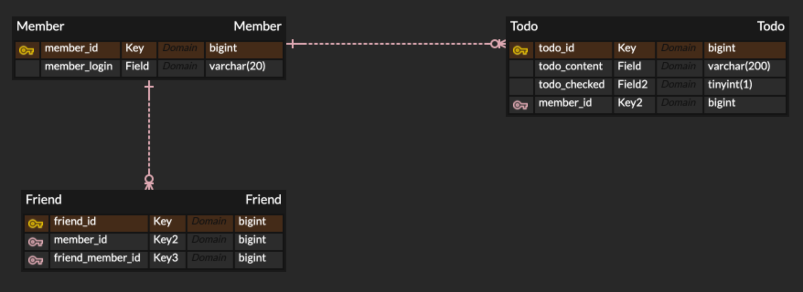
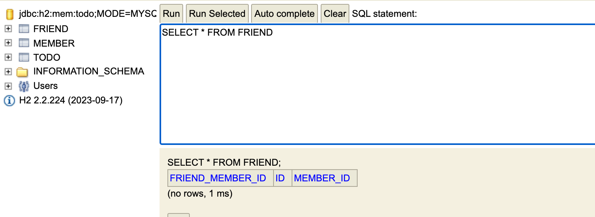

# JPA, DB 설계

---
## ERD를 이용한 DB 설계
• **개체(Entity)** : 문제 상황을 구성하는 요소   
• **관계(Relationship)** : 개체와 개체 사이의 관계  
• **속성(Attribute)** : 개체와 관계가 가지는 세부적인 특징   
이때 하나의 개체를 식별할 수 있는 속성을 **PK(Primary Key)** 라고 한다.  

ER Model은 다음과 같이 DB로 구현할 수 있다.  
• 개체 → 테이블  
• 관계 → 테이블 or 외래키   
• 속성 → 테이블 컬럼   

 개체와 개체는 사이의 관계는 아래와 같은 종류가 있다.  
• 다대일 (N : 1), N : 1 관계는 **외래키**로 구현    
• 일대다 (1 : N), 1 : N 관계는 **외래키**로 구현   
• 일대일 (1 : 1)   
• 다대다 (N : M), N : M 관계는 **테이블**로 구현   

관계를 설정할 때는 보통 비-식별 관계를 선택한다.    
• **식별 관계** : 관계 대상의 PK를 자신의 PK로도 사용하는 것    
• **비-식별 관계** : 관계 대상의 PK를 자신의 **FK**로만 사용하는 것    

---
## JPA 개념  
• **Java Persistence API**  
• 데이터베이스에서 읽어온 데이터를 자바 객체로 매핑하는 자바의 표준 기술 (ORM)     
• **엔티티(Entity)** 는 자바와 데이터베이스가 소통하는 단위  
• 테이블의 데이터 하나(레코드)는 엔티티 객체 하나로 매핑된다.

---
## JPA 를 활용한 DB 구현
### 엔티티 클래스
• 엔티티 클래스는 **테이블**을, 클래스 필드는 **컬럼**을 나타낸다.  
• **@Entity** 어노테이션으로 이 클래스가 **엔티티** 라는 것을 명시    
• **@Id** 어노테이션으로 PK 필드에 이 필드가 **PK** 라는 것을 명시   
• **@GeneratedValue** 를 사용하면 id 값을 자동으로 생성한다.   
• 이때 strategy는 **IDENTITY**로 설정한다. (키 값 결정을 DB에 위임)     
• ERD에서 설계했던 Column 이름과 타입을 맞추기 위해, 필드에 **@Column** 으로 이름과 타입을 명시한다.  

### 엔티티 연관관계
• 외래키 컬럼을 나타낼 때는 Long 타입의 외래키 필드 대신, **해당 엔티티 타입의 엔티티 객체**를 필드로 가지도록 설계한다.  
• FK 컬럼 정보를 명시하는 어노테이션 (컬럼 이름 등) : **@JoinColumn**    
• 해당 외래키로 생기는 연관관계 종류를 나타내는 어노테이션 : **@ManyToOne**   
• 연관관계 종류를 나타내는 어노테이션에는 **fetch** 속성이 있다.   
• 이 속성으로 연결된 엔티티를 언제 가져올지 명시할 수 있다.     
• **EAGER** : 즉시 로딩, Todo 객체 정보를 가져올 때 연결된 User 객체의 모든 정보를 함께 한번에 가져온다.     
• **LAZY** : 지연 로딩, Todo 객체 정보를 가져올 때 연결된 User 객체의 정보는 필요할 때 가져온다.

### 엔티티 생성자
• JPA는 엔티티 객체를 다룰 때 **public 또는 protected의 인자 없는 생성자**가 필요하다.
• **@NoArgsConstructor**를 사용하여 인자 없는 생성자를 만든다.  
• 이때 access 속성을 통해 접근 제한자를 **protected**로 설정한다.     
• 추가로 엔티티 객체에 **@Getter**를 추가해 모든 필드에 getter를 만든다.  

---
# ERD

---
# DB 콘솔
### Friend 엔티티 클래스
